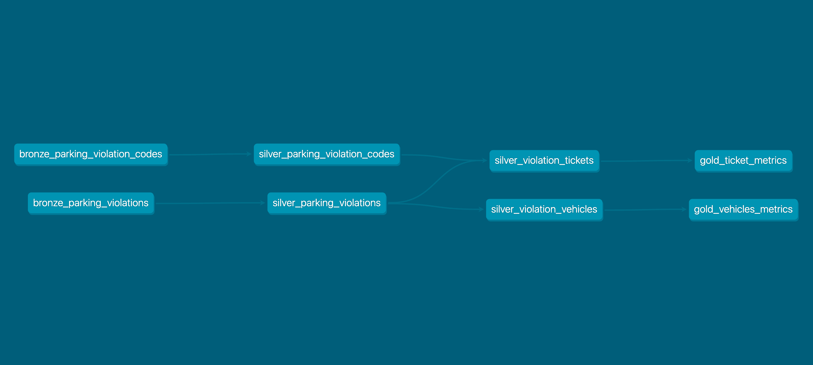

# Welcome to your new dbt project!

## Using the starter project

Try running the following commands:

- dbt run
- dbt test

## Resources
- Learn more about dbt [in the docs](https://docs.getdbt.com/docs/introduction)
- Check out [Discourse](https://discourse.getdbt.com/) for commonly asked questions and answers
- Join the [chat](https://community.getdbt.com/) on Slack for live discussions and support
- Find [dbt events](https://events.getdbt.com) near you
- Check out [the blog](https://blog.getdbt.com/) for the latest news on dbt's development and best practices

Project Breakdown:

1. Bronze Data:
- Goal: raw data with minimal cleaning and transformations 
- Tables: 
  1. bronze_parking_violation_codes
  2. bronze_parking_violations
  
2. Silver Data:
- Goal: cleaned data with applied business logic, ultimately in an established data model.
- Tables:
 1. silver_parking_violation_codes
 2. silver_parking_violations
 3. silver_violation_tickets
 4. silver_violation_vehicles

3. Gold Data:
- Goal: metrics built on top of silver data that are often served to the business via dashboards
- Tables:
 1. gold_ticket_location_metrics
 2. gold_vehicles_metrics 
